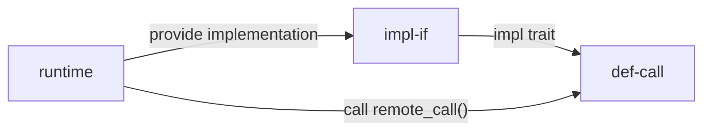

# crate-interface test

`crate-interface` 可以将 `Trait` 的定义/调用与实现放在两个不同的 `crate` 中。

- `call` 与 `def` 需要在同一个 `crate` 中（`def-call`）

- `impl` 的 `crate`（`impl-if`）会依赖 `def-call`

- `runtime` 可通过调用 `def-call` 暴露的函数（`remote_call()`）调用这个 `Trait`

~~依据这个 [issue](https://github.com/rust-lang/rust/issues/96192#issuecomment-1102802829) 所说，Rust 在链接中会遵循 `runtime` `impl-if` `def-call` 的顺序。~~ 感觉没什么关系。

## 由 `runtime` 调用

`runtime` 依赖于 `def-call`，使用其暴露的 `remote_call` 函数。在这一过程中需引入 `impl-if` 库。
因为 `impl-if` 依赖于 `def-call`，所以 `def-call` 不能再依赖于 `impl-if`（会产生循环依赖）。

因此需要在 `runtime` 中申明对 `impl-if` 的依赖。



在试验中，有两种方法可以通过编译。

1. `extern crate impl_if`

2. `use impl_if::dummy_fn_in_impl_if` 使用 `impl-if` 中的某函数

推测 Rust 在编译时会优化掉「仅在 `Cargo.toml` 中声明，而没有实际用到的库（如 `impl-if`）」，导致出现 `Undefined symbols ___If_hello` 的错误。

可以显示声明 `extern crate` 或使用依赖中的某函数来绕过。

```rust
// This works with extern crate:
extern crate impl_if;

fn main() {
    remote_call("from runtime calling def-call with implementation in impl-if");
}
```

```rust
// This works with usage from the dep:
fn main() {
    use impl_if::dummy_fn_in_impl_if;
    dummy_fn_in_impl_if();
    remote_call("from runtime calling def-call with implementation in impl-if");
}
```

```rust
// This works with unused_imports warning:
fn main() {
    use impl_if::dummy_fn_in_impl_if;
    remote_call("from runtime calling def-call with implementation in impl-if");
}
```

```rust
// This doesn't work.
// Seems like rust "removes" unused dependency although listed in Cargo.toml
fn main() {
    remote_call("from runtime calling def-call with implementation in impl-if");
}
```

修改 `lto` 选项没有什么影响，好像不是这个问题。
